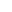

# Schedule

<table>
  <thead>
    <tr>
      <th style="text-align:left;">Week</th>
      <th style="text-align:left;">Date</th>
      <th style="text-align:left;">Topics</th>
      <th style="text-align:left;width:50%;">Read / Watch / Do</th>
    </tr>
  </thead>
  <tbody>
    <tr>
      <td>00</td>
      <td> </td>
      <td>Student Survey</td>
      <td>
        <a href="" target="_new"> <b>Take the Survey</b></a>
      </td>
    </tr>
    <tr>
      <td>01</td>
      <td>8/23</td>
      <td>Course introduction, Concepts & Requirements</td>
      <td>
         <a href="" target="_new">Reading</a>  
      </td>
    </tr>
    <tr>
      <td></td>
      <td>8/25</td>
      <td>Getting Set Up</td>
      <td>
         <a href="" target="_new">Homework</a>  
         <a href="" target="_new">Video</a>  
      </td>
    </tr>
    <tr>
      <td>02</td>
      <td>8/28 - 8/30</td>
      <td>Git & GitHub: Source Control Management</td>
      <td rowspan=2>
         <a href="https://canvas.its.virginia.edu/courses/78571/assignments/333001" target="_new">Homework - GitHub Account</a>  
         <a href="https://canvas.its.virginia.edu/courses/78571/assignments/333000" target="_new">Homework - Git Basics Foundation Course</a>  
         <a href="">Weekly Quiz</a>  
      </td>
    </tr>
    <tr>
      <td></td>
      <td>9/01</td>
      <td class="noclass">No Class</td>
    </tr>
    <tr>
      <td>03</td>
      <td>9/04</td>
      <td class="noclass">No Class - Labor Day</td>
      <td></td>
    </tr>
    <tr>
      <td></td>
      <td>9/06 - 9/08</td>
      <td>Data types / Formats / Schemas</td>
      <td>
         <a href="https://learning.oreilly.com/library/view/python-in-a/9781098113544/ch03.html#data_types" target="_new">[PN] Data Types</a>  
         <a href="" target="_new">Homework</a>  
         <a href="">Weekly Quiz</a>  
      </td>
    </tr>
    <tr>
      <td>04</td>
      <td>9/11 - 9/15</td>
      <td>Starting with Python</td>
      <td>
         <a href="https://learning.oreilly.com/library/view/python-for-data/9781491957653/ch01.html" target="_new">[PDA] Chapter 1: Preliminaries</a>  
         <a href="https://learning.oreilly.com/library/view/python-in-a/9781098113544/ch01.html" target="_new">[PN] Chapter 1: Introduction to Python</a>  
         <a href="" target="_new">Homework</a>  
         <a href="">Weekly Quiz</a>  
      </td>
    </tr>
    <tr>
      <td>05</td>
      <td>9/18 - 9/22</td>
      <td>More with Python / NumPy</td>
      <td>
         <a href="https://learning.oreilly.com/library/view/python-for-data/9781491957653/ch04.html" target="_new">[PDA] Chapter 4: NumPy Basics</a>  
         <a href="" target="_new">Homework</a>  
         <a href="">Weekly Quiz</a>  
      </td>
    </tr>
    <tr>
      <td>06</td>
      <td>9/25 - 9/29</td>
      <td>NumPy / Pandas</td>
      <td>
         <a href="https://learning.oreilly.com/library/view/python-for-data/9781491957653/ch05.html" target="_new">[PDA] Chapter 5: Getting Started with pandas</a>  
         <a href="" target="_new">Homework</a>  
         <a href="">Weekly Quiz</a>  
      </td>
    </tr>
    <tr>
      <td>07</td>
      <td>10/02</td>
      <td>No Class - Reading Days</td>
      <td> </td>
    </tr>
    <tr>
      <td></td>
      <td>10/04 - 10/06</td>
      <td>Data types / Casting / Control Structures</td>
      <td>
         <a href="" target="_new">Homework</a>  
         <a href="">Weekly Quiz</a>  
      </td>
    </tr>
    <tr>
      <td>08</td>
      <td>10/09 - 10/13</td>
      <td>Control structures / Iterating / Functions</td>
      <td>
         <a href="" target="_new">Homework</a>  
         <a href="">Weekly Quiz</a>  
      </td>
    </tr>
    <tr>
      <td>09</td>
      <td>10/16 - 10/20</td>
      <td>Lists / Dictionaries</td>
      <td>
         <a href="" target="_new">Homework</a>  
         <a href="">Weekly Quiz</a>  
      </td>
    </tr>
    <tr>
      <td>10</td>
      <td>10/23 - 10/27</td>
      <td>Recursion</td>
      <td>
         <a href="" target="_new">Homework</a>  
         <a href="">Weekly Quiz</a>  
      </td>
    </tr>
    <tr>
      <td>11</td>
      <td>10/30 - 11/3</td>
      <td>Exception Handling</td>
      <td>
         <a href="" target="_new">Homework</a>  
         <a href="">Weekly Quiz</a>  
      </td>
    </tr>
    <tr>
      <td>12</td>
      <td>11/6 - 11/10</td>
      <td>Introduction to R</td>
      <td>
         <a href="" target="_new">Homework</a>  
         <a href="">Weekly Quiz</a>  
      </td>
    </tr>
    <tr>
      <td>13</td>
      <td>11/13 - 11/17</td>
      <td>More with R</td>
      <td>
         <a href="" target="_new">Homework</a>  
         <a href="">Weekly Quiz</a>  
      </td>
    </tr>
    <tr>
      <td>14</td>
      <td>11/20</td>
      <td>Working with R and data</td>
      <td>
         <a href="" target="_new">Homework</a>  
         <a href="">Weekly Quiz</a>  
      </td>
    </tr>
    <tr>
      <td></td>
      <td>11/22 - 11/26</td>
      <td colspan=2 class="noclass">No Class - Thanksgiving Break</td>
    </tr>
    <tr>
      <td>15</td>
      <td>11/27 - 12/1</td>
      <td class="noclass">No In-Person Class - Online Assignments</td>
      <td>
         <a href="" target="_new">Homework</a>  
         <a href="">Weekly Quiz</a>  
      </td>
    </tr>
    <tr>
      <td>16</td>
      <td>12/4</td>
      <td>Final Class - Wrap Up</td>
      <td></td>
    </tr>
  </tbody>
</table>
